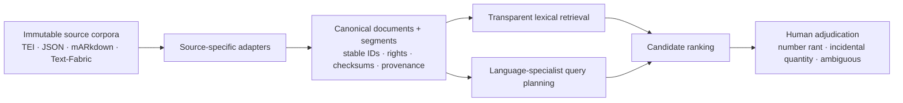

# Number Rants: A Multilingual Qualitative-Number Corpus

Status: active digital-humanities research infrastructure

Started: 2026-07-09

Current phase: acquisition complete for the first major waves; canonical
normalization and cross-lingual retrieval in progress

## The Question

Premodern writers often did more than count with numbers. They treated six as
perfect, twelve as cosmic or apostolic, forty as transformational, musical
ratios as moral order, and numbered sequences as maps of bodies, heavens,
virtues, histories, or divine relationships.

This project asks:

> Can we build a multilingual, source-auditable corpus of passages where
> numbers receive sustained qualitative meaning—and then search it without
> allowing incidental quantities to bury the interesting material?

The working term **number rant** is intentionally memorable. The scholarly
object is a bounded passage that explains, praises, allegorizes, theologizes,
cosmologizes, moralizes, personifies, or otherwise assigns qualitative
significance to a number, ratio, numerical structure, or ordered sequence.

## Why the Corpus Is Large First

Small curated corpora are useful for testing annotation, but they also inherit
the researcher's existing expectations. This project begins with broad lawful
acquisition so unknown traditions, commentaries, translations, and embedded
digressions can surprise the inquiry. Digital absence is tracked as a gap; it
is never treated as evidence of historical absence.

## What Exists Now

As of 2026-07-14, the local research environment includes:

| Corpus or layer | Validated local result |
|---|---:|
| Corpus Corporum | 10,078 identifiable text sets across 30 collections |
| Canonical Corpus Corporum v1 | 9,939 documents and 1,491,851 searchable segments |
| Sefaria JSON | 19,705 text versions, 6,595 schemas, 22 link/metadata datasets |
| OpenITI 2025.1.9 | 14,107 versions representing 9,109 works |
| Patristic Text Archive | 1,253 XML-named files; pinned Git snapshot |
| Coptic SCRIPTORIUM | 1,458 XML and 1,717 CoNLL-U files plus other representations |
| ETCBC BHSA | 786 Text-Fabric feature files; pinned Git snapshot |
| Greek, Latin, Syriac, OCR, and targeted editions | Perseus, First1KGreek, Digital Syriac Corpus, PG OCR, Evagrius, and public-domain editions |

The raw and derived local library is approximately 60 GiB. Raw corpora are
not included in a public repository.

Early confirmed holdings include Thabit ibn Qurra's Arabic translation of
Nicomachus's *Introduction to Arithmetic*, the *Epistles of the Brethren of
Purity*, the complete Coptic *Pistis Sophia*, *Sefer Yetzirah*, the *Bahir*,
the Zoharic corpus, and broad Greek and Latin philosophical and Christian
collections.

## Architecture



Technical version: source-specific normalizers write versioned canonical
document and segment records with stable IDs, source hashes, rights, language,
citation context, and exact source addresses.

Plain-language version: the original books remain untouched. Each new wing
gets a consistent card catalog and searchable reading slips that always point
back to the exact book and location.

## Design Commitments

- **Immutable sources:** acquisition does not rewrite source corpora.
- **Reproducible derivatives:** canonical databases can be deleted and rebuilt.
- **Stable identity:** upstream IDs and hashes, not titles, identify books.
- **Visible uncertainty:** malformed XML, incomplete OCR, unavailable POS data,
  duplicate witnesses, and unknown licenses remain explicit.
- **Rights-aware publication:** local research access never becomes an assumed
  blanket redistribution license.
- **Human verification:** AI assists discovery and ranking; scholars adjudicate
  meaning and false positives.
- **Cross-lingual planning before search:** future Greek, Latin, Hebrew,
  Aramaic, Syriac, Coptic, and Arabic librarians will expand an English
  research question into language-appropriate terms, morphology, idiom, and
  abbreviations before querying their shelves.

## Current Search Floor

Corpus Corporum v1 uses SQLite FTS5 as a transparent lexical baseline. Its
1,491,851 segments preserve language, citation labels, XML start/end paths,
source checksums, and extraction status. This is intentionally inspectable
before semantic or agentic retrieval is added.

The first live spot check surfaced a passage in *Acta Sanctorum, Iulius 7*
that discusses Greek `ἑξάς` / Latin `senarius` as beautiful and perfect.

The Project Day shelf now has its own manifest-driven search floor. Thirty
complete Perseus Latin works normalize into 61,651 provenance-locked passages
in a rebuildable SQLite FTS5 database. A developer can build it with
`python3 tools/build_demo_latin_corpus.py` and inspect literal results with
`python3 tools/search_demo_latin_corpus.py somnium`. An individual badger
proposal can receive a diagnostic shelf check with
`python3 tools/search_demo_latin_corpus.py domus --preview --sample-limit 3`.
See `schema/PERSEUS_LATIN_DEMO_ADAPTER_V1.md` and
`schema/BADGER_ADAPTATION_CONTRACT_V1.md` for technical and plain-language
receipts. The index and preview are real and locally verified. A reproducible
D1 serving projection now connects individual badger proposals to the
Explorer's diagnostic shelf check, while public D1 loading and full approved-
plan retrieval remain open. The live Latin badger turns an approved fox table
into strict, inspectable, still-unverified folios before those checks can run.

## Build Week Explorer

The public-facing vertical slice lives in `explorer/`. The fox clarification
room and editable concept worktable operate dynamically with an API key. A
small rights-safe passage packet remains a regression fixture, while the new
30-work Latin index supplies the real retrieval floor that will enter after
the language-specialist handoff:

```text
English question → inspectable concept map → Greek and Latin query adaptation
→ provenance-locked candidate judgments → human-reviewed reading list
```

Technical version: a server-side Responses API route asks GPT-5.6 for strict
structured output, accepts judgments only for supplied candidate IDs, and
joins those judgments back to immutable source metadata.

Plain-language version: the AI librarians may recommend or reject books placed
on their desk, but they cannot quietly invent a new book or replace its library
card. See `docs/BUILD_WEEK_PRODUCT_BRIEF.md` and `explorer/README.md`.

## Repository Map

- `source_universe.csv` — 39 public, search-only, catalog-only, subscription,
  and library reservoirs
- `PROJECT_STATE.md` — cold-start technical handoff and exact next move
- `candidate_works.csv` — high-recall seed works and traditions, not a canon
- `acquisition_log.md` — dated versions, commits, checksums, repairs, and
  limitations
- `schema/` — canonical SQL and technical/plain-language schema rationale
  plus the frozen OpenITI adapter contract
- `tools/` — acquisition, validation, recovery, normalization, inventory, and
  portability utilities
- `tests/` — deterministic extraction and safety tests
- `docs/PORTABILITY.md` — external-drive and future-computer migration plan
- `docs/PUBLICATION_BOUNDARY.md` — what may and may not enter a public repo

## Run the Tests

The normalization tests use Python's standard library. Acquisition utilities
also require `requests`.

```bash
python3 -m unittest discover -s tests -v
```

## Verify a Local Library

Quick structural and catalog audit:

```bash
python3 tools/verify_library_portability.py
```

Deep post-migration fingerprint audit:

```bash
python3 tools/verify_library_portability.py --deep
```

## Publication and Rights

This repository is designed to publish infrastructure, research decisions,
source maps, schemas, tests, and permitted metadata—not a shadow copy of the
source libraries. Corpus Corporum is retained for non-commercial research.
OpenITI is CC BY-NC-SA 4.0 with source-level provenance variation. Sefaria
rights are version-specific. PTA, Coptic SCRIPTORIUM, BHSA, OCR datasets, and
individual editions retain their own licenses and attribution requirements.

Project source code is released under the MIT License. Original project
documentation is licensed under CC BY 4.0 except where otherwise noted.
Neither license applies to third-party corpora, editions, translations, or
source records. See `LICENSE`, `LICENSE-DOCUMENTATION.md`,
`DATA_LICENSES.md`, and `docs/PUBLICATION_BOUNDARY.md`.

## Roadmap

1. Build canonical v2 for Corpus Corporum including the 139 recovered texts.
2. Add versioned adapters for OpenITI, Sefaria, PTA, Coptic SCRIPTORIUM, and
   BHSA without collapsing editions or parallel representations.
3. Implement conversational query planning and language-specialist expansion.
4. Rank qualitative interpretation above incidental quantities such as “six
   donkeys.”
5. Create an auditable adjudication set and evaluate recall, precision, and
   cross-lingual blind spots.
6. Publish a rights-safe project site and research interface.

## Project Character

This is both a scholarly corpus and an AI implementation experiment: a test of
whether large language models can help discover historically meaningful
patterns across formats and languages while preserving provenance, licensing,
human judgment, and the right to inspect how an answer was found.
