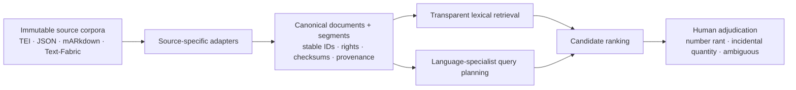

# The Inhabited Archive

> Translate the question. Not the library.

The Inhabited Archive is an inspectable AI research desk for bounded historical
corpora. A scholar asks a question in the language they know; a fox makes the
question explicit, a badger adapts the approved concept map to the installed
library's source language, deterministic retrieval finds literal passages, and
an owl ranks the resulting reading list without replacing human interpretation.

This repository contains the complete OpenAI Build Week Education submission
and its research foundation, Number Rants.

- **Try the no-key demonstration:** <https://inhabited-archive.shaytaki.chatgpt.site>
- **Install it yourself:** [`docs/INSTALL_THE_INHABITED_ARCHIVE.md`](docs/INSTALL_THE_INHABITED_ARCHIVE.md)
- **Download the 30-work Latin serving shelf:** [Build Week release](https://github.com/shaycranmer/inhabited-archive/releases/tag/v0.1.0-build-week)
- **Read the submission story:** [`docs/SUBMISSION_STORY.md`](docs/SUBMISSION_STORY.md)
- **Inspect the application:** [`explorer/`](explorer/)

## What the scholar experiences

```text
English research question
→ fox clarification and editable concept table
→ scholar-approved historical and genre scope
→ Latin badger folios with reversible inclusions and exclusions
→ deterministic, deduplicated retrieval from a declared 30-work shelf
→ owl reading leaves with original text, context, caveats, and working translation
→ linked receipts preserved across reruns
```

Technical version: GPT-5.6 performs bounded structured reasoning at the fox,
badger, and owl desks. Application code—not the model—enforces catalogue scope,
executes lexical retrieval, deduplicates overlapping passages, verifies source
identities, and preserves reproducibility receipts.

Plain-language version: the librarians may suggest how to ask, search, and
prioritize, but they cannot quietly invent a book, erase an inconvenient hit,
or pretend that one small shelf represents all of history.

## Build Week contribution

Number Rants began before the July 13 submission period as a research question,
source-discovery effort, early codebook, and growing local corpus. There was no
public or judge-runnable application, GPT-5.6 integration, language-librarian
workflow, rights-cleared demo shelf, or end-to-end evidence interface.

During Build Week, Shay Cranmer and Codex created The Inhabited Archive's
complete runnable vertical slice: the live fox and concept table; historical,
genre, and tradition scope; Latin badger adaptation; the reviewed 30-work
Perseus shelf; deterministic retrieval and overlap deduplication; immutable run
history; owl adjudication; labeled machine translation; visual system; safety
gates; tests; installation path; and hosted demonstration. GPT-5.6 supplies the
runtime librarians' structured reasoning. Codex accelerated architecture,
implementation, evaluation, visual iteration, documentation, provenance work,
and due-day hardening under Shay's scholarly and product direction.

The dated history begins with the conservative pre-submission inventory in
[`BUILD_WEEK_BASELINE.md`](BUILD_WEEK_BASELINE.md). That file and the Git commit
history distinguish inherited research from work added during the official
submission window.

## Quick local start

Requirements: Node.js 22.13 or later and pnpm. The interface opens without a
secret; live original questions require an OpenAI API key.

```bash
cd explorer
pnpm install
pnpm run dev
```

Open <http://localhost:3000>. For the full Latin retrieval shelf and live model
setup, follow the [installation manual](docs/INSTALL_THE_INHABITED_ARCHIVE.md).

## Research foundation: Number Rants

Status: active multilingual digital-humanities research infrastructure

Started: 2026-07-09

## The Question

Premodern writers often did more than count with numbers. They treated six as
perfect, twelve as cosmic or apostolic, forty as transformational, musical
ratios as moral order, and numbered sequences as maps of bodies, heavens,
virtues, histories, or divine relationships.

This project asks:

> Can we build a multilingual, source-auditable corpus of passages where
> numbers receive sustained qualitative meaning—and then search it without
> allowing incidental quantities to bury the interesting material?

The working term **number rant** is intentionally memorable. The scholarly
object is a bounded passage that explains, praises, allegorizes, theologizes,
cosmologizes, moralizes, personifies, or otherwise assigns qualitative
significance to a number, ratio, numerical structure, or ordered sequence.

## Why the Corpus Is Large First

Small curated corpora are useful for testing annotation, but they also inherit
the researcher's existing expectations. This project begins with broad lawful
acquisition so unknown traditions, commentaries, translations, and embedded
digressions can surprise the inquiry. Digital absence is tracked as a gap; it
is never treated as evidence of historical absence.

## What Exists Now

As of 2026-07-14, the local research environment includes:

| Corpus or layer | Validated local result |
|---|---:|
| Corpus Corporum | 10,078 identifiable text sets across 30 collections |
| Canonical Corpus Corporum v1 | 9,939 documents and 1,491,851 searchable segments |
| Sefaria JSON | 19,705 text versions, 6,595 schemas, 22 link/metadata datasets |
| OpenITI 2025.1.9 | 14,107 versions representing 9,109 works |
| Patristic Text Archive | 1,253 XML-named files; pinned Git snapshot |
| Coptic SCRIPTORIUM | 1,458 XML and 1,717 CoNLL-U files plus other representations |
| ETCBC BHSA | 786 Text-Fabric feature files; pinned Git snapshot |
| Greek, Latin, Syriac, OCR, and targeted editions | Perseus, First1KGreek, Digital Syriac Corpus, PG OCR, Evagrius, and public-domain editions |

The raw and derived local library is approximately 60 GiB. Raw corpora are
not included in a public repository.

Early confirmed holdings include Thabit ibn Qurra's Arabic translation of
Nicomachus's *Introduction to Arithmetic*, the *Epistles of the Brethren of
Purity*, the complete Coptic *Pistis Sophia*, *Sefer Yetzirah*, the *Bahir*,
the Zoharic corpus, and broad Greek and Latin philosophical and Christian
collections.

## Architecture



Technical version: source-specific normalizers write versioned canonical
document and segment records with stable IDs, source hashes, rights, language,
citation context, and exact source addresses.

Plain-language version: the original books remain untouched. Each new wing
gets a consistent card catalog and searchable reading slips that always point
back to the exact book and location.

## Design Commitments

- **Immutable sources:** acquisition does not rewrite source corpora.
- **Reproducible derivatives:** canonical databases can be deleted and rebuilt.
- **Stable identity:** upstream IDs and hashes, not titles, identify books.
- **Visible uncertainty:** malformed XML, incomplete OCR, unavailable POS data,
  duplicate witnesses, and unknown licenses remain explicit.
- **Rights-aware publication:** local research access never becomes an assumed
  blanket redistribution license.
- **Human verification:** AI assists discovery and ranking; scholars adjudicate
  meaning and false positives.
- **Cross-lingual planning before search:** future Greek, Latin, Hebrew,
  Aramaic, Syriac, Coptic, and Arabic librarians will expand an English
  research question into language-appropriate terms, morphology, idiom, and
  abbreviations before querying their shelves.

## Current Search Floor

Corpus Corporum v1 uses SQLite FTS5 as a transparent lexical baseline. Its
1,491,851 segments preserve language, citation labels, XML start/end paths,
source checksums, and extraction status. This is intentionally inspectable
before semantic or agentic retrieval is added.

The first live spot check surfaced a passage in *Acta Sanctorum, Iulius 7*
that discusses Greek `ἑξάς` / Latin `senarius` as beautiful and perfect.

The Project Day shelf now has its own manifest-driven search floor. Thirty
complete Perseus Latin works normalize into 61,651 provenance-locked passages
in a rebuildable SQLite FTS5 database. A developer can build it with
`python3 tools/build_demo_latin_corpus.py` and inspect literal results with
`python3 tools/search_demo_latin_corpus.py somnium`. An individual badger
proposal can receive a diagnostic shelf check with
`python3 tools/search_demo_latin_corpus.py domus --preview --sample-limit 3`.
See `schema/PERSEUS_LATIN_DEMO_ADAPTER_V1.md` and
`schema/BADGER_ADAPTATION_CONTRACT_V1.md` for technical and plain-language
receipts. The index and preview are real and locally verified. A reproducible
D1 serving projection now connects both individual badger proposal checks and
full approved-plan retrieval to the Explorer. The live Latin badger turns an
approved fox table into strict, inspectable, still-unverified folios;
application code then executes their literal forms, deduplicates overlapping
passages, and builds an immutable candidate packet. The hosted build stages the
reviewed shelf as ordered D1 migrations; the same receipt is checked again
before any live coverage preview or retrieval.

## The Inhabited Archive Explorer

The public-facing vertical slice lives in `explorer/`. The fox clarification
room and editable concept worktable operate dynamically with an API key. A
small rights-safe passage packet remains a regression fixture, while the new
30-work Latin index supplies the real retrieval floor that will enter after
the language-specialist handoff:

```text
English question → inspectable concept map → language-and-corpus adaptation
→ real bounded retrieval → provenance-locked owl judgments → human reading
```

Technical version: a server-side Responses API route asks GPT-5.6 for strict
structured output, accepts judgments only for supplied candidate IDs, and
joins those judgments back to immutable source metadata.

Plain-language version: the AI librarians may recommend or reject books placed
on their desk, but they cannot quietly invent a new book or replace its library
card. See `docs/BUILD_WEEK_PRODUCT_BRIEF.md` and `explorer/README.md`.

The implemented Latin slice is now end to end. A July 20 local run reduced 126
literal passage matches to 121 overlap-aware units, sent 18 bounded candidates
to the owl, and returned 18 evidence-grounded judgments. Four strong results
received automatic working translations; a liminal result received a separate
on-demand addendum; thirteen incidental word hits stayed inspectable without
automatic translation. Every rerun becomes a linked immutable receipt rather than
overwriting its predecessor. See `schema/RETRIEVAL_RUN_CONTRACT_V1.md` and
`schema/OWL_READING_AID_CONTRACT_V1.md`.

The longer product direction is a portable scholarly staff for a bounded
digital library. A source adapter builds the shared catalogue beside the
untouched corpus; supported language specialists adapt approved questions to
that shelf; the owl returns a citable reading list with provisional working
translations for triage. The current demonstration proves this architecture
through Latin. Greek is the preferred second complete slice after the Latin
journey's visual and deployment work is stable.

## Repository Map

- `source_universe.csv` — 39 public, search-only, catalog-only, subscription,
  and library reservoirs
- `PROJECT_STATE.md` — cold-start technical handoff and exact next move
- `candidate_works.csv` — high-recall seed works and traditions, not a canon
- `acquisition_log.md` — dated versions, commits, checksums, repairs, and
  limitations
- `schema/` — canonical SQL and technical/plain-language schema rationale
  plus the frozen OpenITI adapter contract
- `tools/` — acquisition, validation, recovery, normalization, inventory, and
  portability utilities
- `tests/` — deterministic extraction and safety tests
- `docs/PORTABILITY.md` — external-drive and future-computer migration plan
- `docs/PUBLICATION_BOUNDARY.md` — what may and may not enter a public repo

## Run the Tests

The normalization tests use Python's standard library. Acquisition utilities
also require `requests`.

```bash
python3 -m unittest discover -s tests -v
```

## Verify a Local Library

Quick structural and catalog audit:

```bash
python3 tools/verify_library_portability.py
```

Deep post-migration fingerprint audit:

```bash
python3 tools/verify_library_portability.py --deep
```

## Publication and Rights

This repository is designed to publish infrastructure, research decisions,
source maps, schemas, tests, and permitted metadata—not a shadow copy of the
source libraries. Corpus Corporum is retained for non-commercial research.
OpenITI is CC BY-NC-SA 4.0 with source-level provenance variation. Sefaria
rights are version-specific. PTA, Coptic SCRIPTORIUM, BHSA, OCR datasets, and
individual editions retain their own licenses and attribution requirements.

Project source code is released under the MIT License. Original project
documentation is licensed under CC BY 4.0 except where otherwise noted.
Neither license applies to third-party corpora, editions, translations, or
source records. See `LICENSE`, `LICENSE-DOCUMENTATION.md`,
`DATA_LICENSES.md`, and `docs/PUBLICATION_BOUNDARY.md`.

## Roadmap

1. Add a complete Greek shelf and language specialist after ratification.
2. Export and restore durable scholar workspaces and linked retrieval history.
3. Evaluate retrieval recall, ranking precision, translation quality, and
   cross-lingual blind spots against a human-adjudicated set.
4. Add versioned adapters for OpenITI, Sefaria, PTA, Coptic SCRIPTORIUM, and
   BHSA without collapsing editions or parallel representations.
5. Share a reusable adapter toolkit so scholars can place the librarians in
   front of other bounded, rights-cleared digital libraries.

## Project Character

This is both a scholarly corpus and an AI implementation experiment: a test of
whether large language models can help discover historically meaningful
patterns across formats and languages while preserving provenance, licensing,
human judgment, and the right to inspect how an answer was found.
